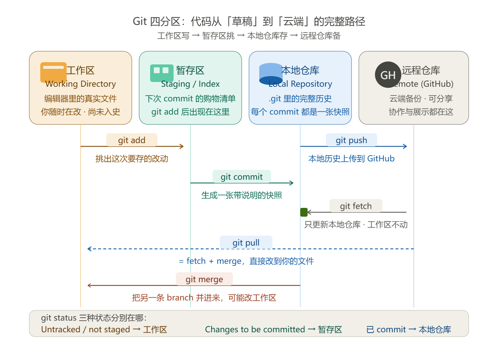

# 散装笔记

## Git

下载 windows： **https://git-scm.com/download/win**

终端输入 `git --version` 查看版本号

`git init`：initialize初始化，把一个文件夹进行git init就是把这个文件夹使用git管理起来，让这个文件夹变成一个git仓库（Git Repository）

**.gitignore**：该类型文件内声明了哪些文件不受到Git管理

### Commit（提交）

是 Git 里的一次「存档」，把你当前代码的改动，打包成一个有说明的历史记录点，每个记录点都有对应的ID。

commit ID 又叫做 commit Hash

> `git add .`：把当前目录的改动放进「暂存区」（准备存档的内容）
>
> `git commit -m "..."`：真正创建存档，并写一条**说明这次改了什么**，引号里的文字叫 **commit message**
>
> `git checkout`：
>
> `discard`：在未提交时，放弃还没commit的文件更改
>
> `git reset --hard<Commit ID>`：单人使用的分支还没提交远端仓库时，把仓库强制回退到某个历史提交
>
> `git revert <Commit ID>`：多人协作的分支，生成一个反向提交来抵消某次的历史提交
>
> `git push`：把存档同步到云端（GitHub）

### Branch（分支）

存储库的不同开发线，是代码的一条「平行时间线」，你可以在这条线上改东西，**不影响主线main/master（主干分支）**，改好了再合并回去（merge）。

> `git branch`；看当前在哪个分支（通常一开始是 main / master）
>
> `git switch -c feat/cli-import-md`：建一个新分支并切换过去（从当前 commit 分叉）
>
> `git add . ` + `git commit -m "feat: 支持导入 Markdown"`：\# 在这个分支上改代码、add、commit……
>
> `git switch main`：切回主线
>
> `git merge feat/cli-import-md`：把分支合并进主线
>
> `git bran	ch -d feat/cli-import-md`：确认没用了，可以删掉分支

> 分支命名的小习惯
>
> feat/xxx    新功能    feat/cli-import-md
>
> fix/xxx     修 bug     fix/search-case-sensitivity
>
> docs/xxx    文档      docs/readme-quickstart
>
> chore/xxx   杂务      chore/gitignore

### WorkTree（Git工作树）

是「同一个仓库，多个文件夹」，你可以同时在多个目录里检出不同分支，互不抢文件。

> `git worktree add ../agent-learning-hotfix -b fix/search-crash`：从当前仓库分出一个新工作树，并新建分支
>
> `git worktree add ../agent-learning-rag feat/rag-pipeline`：分出工作树，检出已有分支
>
> `git worktree list`：看当前仓库挂了哪些工作树
>
> `git worktree remove ../agent-learning-hotfix`：用完删掉（只删工作树目录，分支还在）

### Conflict（冲突）

 是 Git 不知道该听谁的：两条线改了**同一处代码**，合并时没法自动决定保留哪边，只能停下来让你手动选。

> 1. 触发合并，发现冲突
>
>    ` git merge feat/case-insensitive `
>
>    CONFLICT ... 
>
> 2. 看哪些文件冲突了 
>
>    `git status `
>
> 3. 打开冲突文件，手动改成正确版本 
>
>    - 保留 HEAD 的写法？ 
>
>    - 保留对方的写法？ 
>    -  还是两边都要，拼成一个新版本？ 
>
> 4. 确认文件里没有 `<<<<<<< ======= >>>>>>> `了 
>
>    `git add search.py `
>
> 5. 完成这次合并（会自动生成一个 merge commit）
>
>    ` git commit`

### Git Areas（Git分区）

